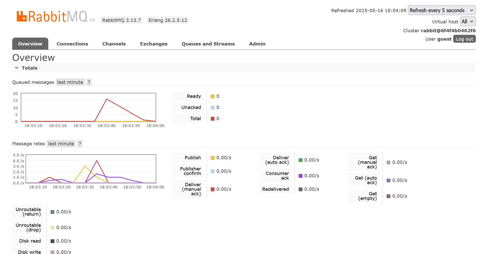

## a. What is amqp?

AMQP stands for Advanced Message Queuing Protocol. It is an open standard protocol for message-oriented middleware that enables systems to communicate by sending messages between clients and servers, often used for reliable, asynchronous communication in distributed systems.

## b. What does it mean? guest:guest@localhost:5672 , what is the first guest, and what is the second guest, and what is localhost:5672 is for?

In the connection string `guest:guest@localhost:5672`:

- The first `guest` is the username used to connect to the message broker (such as RabbitMQ).
- The second `guest` is the password for that user.
- `localhost` refers to the server address (in this case, the local machine).
- `5672` is the port number on which the AMQP broker is listening for connections (the default port for AMQP).

## Simulation Slow Subscriber

When running the publisher 4 times rapidly, each run sends 5 messages, totaling 20 messages sent to RabbitMQ. Because the subscriber is slow (due to the artificial delay), it cannot process messages as quickly as they arrive. As a result, messages accumulate in the queue. The monitoring screen shows approximately 15 queued messages, reflecting the difference between the rate of publishing and the slower rate of consumption by the subscriber.
